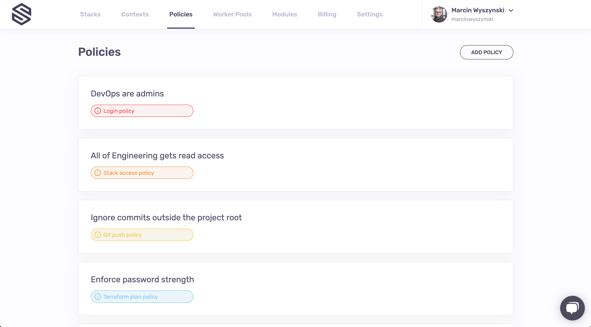

# So you want to take Spacelift for a spin?

This repository is designed just for this purpose. So, fork it to a GitHub account you manage (either your private account or an organization you have admin rights on) and let's get started.

In this tutorial you will not be using any cloud providers, you won't need any extra credentials and the only resources you will manage are the ones managed by [Spacelift's own Terraform provider](https://github.com/spacelift-io/terraform-provider-spacelift/).

## Step 1: Installing GitHub application

Provisioning a Spacelift account is fully automated and only involves [installing the GitHub app](https://github.com/apps/spacelift-io/installations/new). At this point it's up to you to decide whether to give Spacelift access to all your repositories...

...or just the selected ones:

**Note**: don't agonize over this choice - you can always change it later.

Installing the application takes you to your first Spacelift screen where you can create your first stack.

## Step 2: Creating your first stack

[Stacks](https://docs.spacelift.io/concepts/stack) are probably the most important concept in Spacelift. They connect your code and your infra, with some configuration in-between. To keep things short, a Spacelift stack maps directly to a single Terraform state file.

### VCS integration

So without further ado, let's go through the stack creation process step by step. First, we need to tell Spacelift where the project code lives - this is the _Integrate VCS_ step. Since in the previous step I only gave Spacelift access to a single repository (safety first), and this repository only has a single branch, my choices here are rather... limited. But you get the idea - you select the repo, you select the default branch to deploy from and off you go:

### Stack behavior

In the next step you will define some things about this stack's behavior. Since this is meant to be a quick and snappy tutorial we won't go into the details, but you can read more about them [here](https://docs.spacelift.io/concepts/stack). For now the only tweak we need to do here is to mark the stack as [administrative](https://docs.spacelift.io/concepts/stack#administrative). Why? Because only administrative stacks can manage Spacelift resources and that's what we'll be creating as part of this lab.

### Managing state

The next step is all about managing [Terraform state](https://www.terraform.io/docs/state/index.html). Spacelift can work with any remote state provider but it also provides its own state backend - though beyond convenience there are no benefits to using it. We don't have an existing state to import, so we do the most convenient thing there is - continue the defaults:

### Naming the stack

As they say, _there are 2 hard problems in computer science: cache invalidation, naming things, and off-by-1 errors_. We'll make it easy this time: we've come up with a good name for your first stack, so feel free copy it. For now we won't care about [labels](https://docs.spacelift.io/concepts/stack#labels) or description (yes, we support Markdown), though you can read up on them when you're done with this lab.

Congrats, you have your first stack. It doesn't do much, but we'll change it in the next step.

## Step 3: Triggering a run

Creating a stack takes you to a very sad looking screen:

Let's add some color here. We can do that by clicking the _Trigger_ button in the upper right hand corner of the screen. The trigger button will create a Spacelift job that will check out you code, run the usual Terraform commands on it and present you with the choice on whether you want to apply them or not:

You can always refer to the logs directly to see what's changing. In this case, we're creating 24 Spacelift resources, and they all look good. So let's confirm and see what happens next:

Wow, 6 seconds? That was quick! Let's go back to our main (Stacks) screen to see what we've just done.

## Step 4: Exploring created resources

What we just did in Step 3 was creating a bunch of very useful Spacelift resources. Looking at the main screen we can quickly notice two things - our _Terraform starter_ stack turned green (always a good sign!) and there's another Stack we haven't seen before, called _Managed stack_:

### Environment

Now where did _that_ come from? In fact, we had it declared it using Terraform, just [here](./stack.tf). The same file defines a bunch of things related to the environment, so let's click on the name of the new stack to be taken to its screen. Since it doesn't contain anything interesting just yet, let's quickly navigate to the _Environment_ screen. And it's indeed a very busy screen, so let's just look at the first section there:

What we see is a bunch of [environment variables](https://docs.spacelift.io/concepts/environment#environment-variables) and [mounted files](https://docs.spacelift.io/concepts/environment#environment-variables) - [some public and some secret](https://docs.spacelift.io/concepts/environment#a-note-on-visibility) - that we indeed saw defined in the [`stack.tf`](./stack.tf) we've only just looked at. But there are others - see the ones with the blue label to their right? Where did they come from? They're actually defined [here](./context.tf) and they belong to a context that's attached to the new Stack.

But before we move on to the context, click the _Edit_ button in the upper right hand corner of the screen and play around with environment variables and mounted files.

### Context

[Contexts](https://docs.spacelift.io/concepts/context) are how Spacelift does configuration reuse. Rather than having to copy and paste a bunch of configuration variables, Spacelift allows you to encapsulate them as a package and [attach](https://docs.spacelift.io/concepts/context#attaching-and-detaching) them to as many stacks as you want. So if you navigate back to the main screen (hint: click on the logo, it normally works like that single button on your iPhone) and then go to the Contexts screen, that's what you're going to see:

Clicking on the context name takes you to the context screen, where you can see that it currently contains two environment variables (one plaintext and one secret) and two mounted files, one plaintext and one secret:

Note that you can edit the context just as you can edit the Stack's own environment. That _Edit_ button is there for a reason, so go wild for a while before we move on to [policies](https://docs.spacelift.io/concepts/policy), which are the second most important topic in Spacelift.

### Policies

